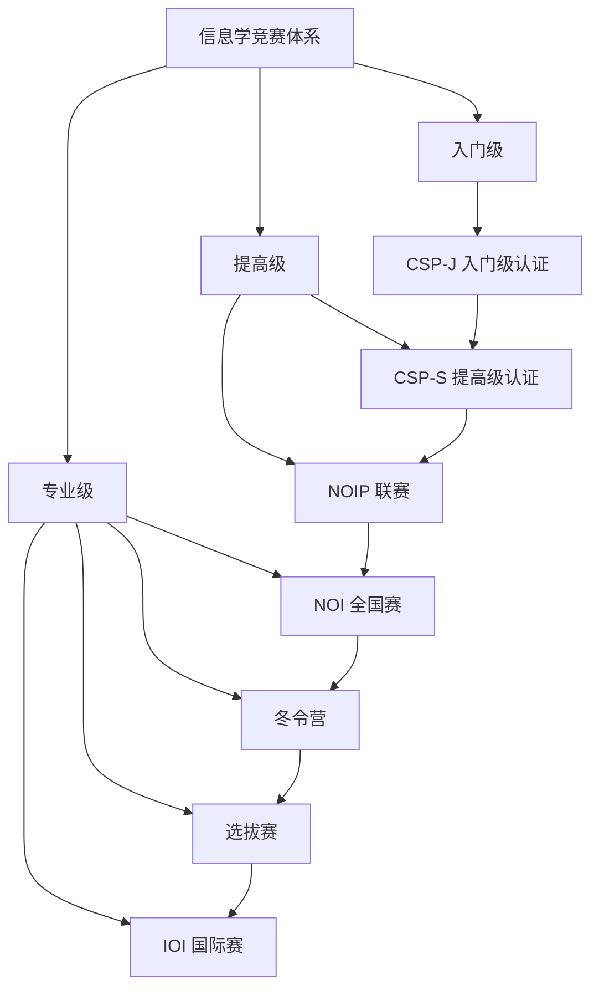

# 竞赛资讯

欢迎来到竞赛资讯页面！这里汇集了信息学奥林匹克竞赛相关的重要信息和官方文档。

## 📚 竞赛介绍

### [全国青少年信息学奥林匹克竞赛系列活动简介](./全国青少年信息学奥林匹克竞赛系列活动简介.md)

全面介绍NOI系列竞赛活动，包括：
- **NOI** - 全国青少年信息学奥林匹克
- **NOIP** - 全国青少年信息学奥林匹克联赛  
- **冬令营** - 年度培训活动
- **APIO** - 亚洲与太平洋地区信息学奥赛
- **选拔赛** - 国际队选拔
- **IOI** - 国际信息学奥林匹克竞赛
- **CSP-J/S** - CCF非专业级软件能力认证

## 📋 竞赛规则

### [关于NOI系列赛编程语言使用限制的规定](./关于NOI系列赛编程语言使用限制的规定.md)

详细说明NOI系列竞赛中的编程规范，包括：
- 编程通则和文件提交规则
- C/C++/Pascal语言的具体限制
- 程序行为和内存使用限制
- 合法性判定标准

### [关于参加CSP-J/S认证需符合年龄条件的公告](./关于参加CSP-J_S认证需符合年龄条件的公告.md)

CSP-J/S认证的年龄限制规定：
- 参赛年龄要求
- 政策背景和原因
- 实施时间和适用范围

### [关于 CSP-J/S 数据提交格式的说明](./关于%20CSP-J_S%20数据提交格式的说明.md)

CSP-J/S数据提交的标准化要求：
- 数据清单和目录结构
- 选手名单格式规范
- 答案目录组织方式
- 各省市编码对照表

## 🎯 竞赛体系结构

## 🏆 竞赛时间线

| 时间 | 竞赛活动 | 说明 |
|------|----------|------|
| 10-11月 | CSP-J/S认证 | 第一轮、第二轮认证 |
| 次年5月 | APIO | 亚太地区信息学奥赛 |
| 次年7-8月 | NOI | 全国青少年信息学奥林匹克 |
| 次年1-2月 | 冬令营 | 培训和选拔活动 |
| 次年3-4月 | 选拔赛 | 国际队选拔 |
| 次年7-9月 | IOI | 国际信息学奥林匹克 |

## 🔗 相关链接

- [中国计算机学会 NOI](http://www.noi.cn/)
- [NOI官方网站](https://noi.cn/)
- [CCF官方网站](https://www.ccf.org.cn/)

## 📢 重要提醒

::: warning 注意事项
1. 所有竞赛规则以官方最新发布为准
2. 参赛前请仔细阅读相关规定和要求
3. 建议关注官方网站获取最新资讯
:::

